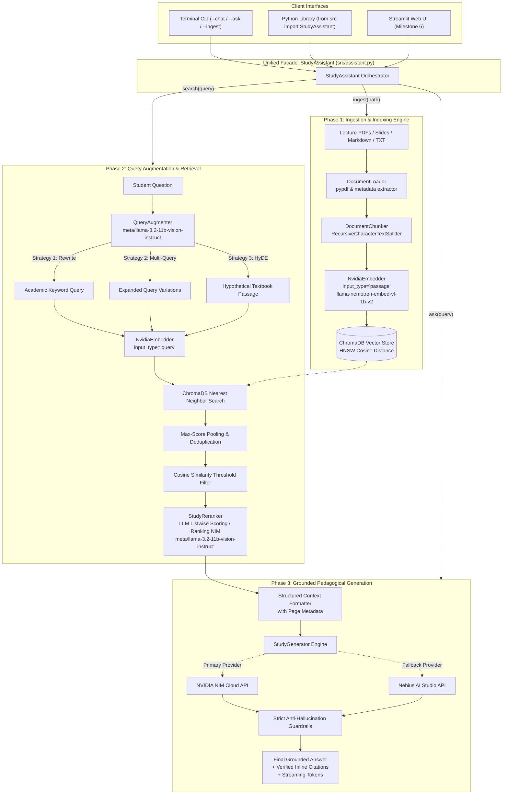
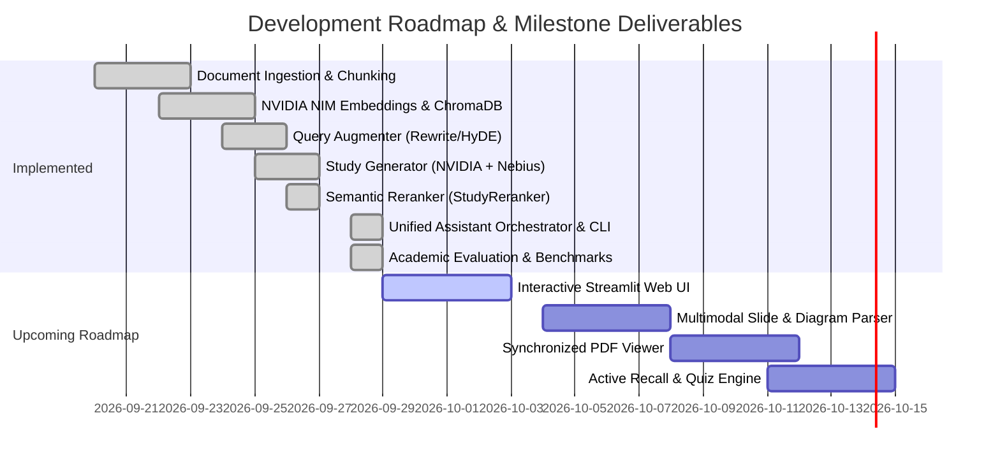

<div align="center">

# 🎓 Study Assistant: Grounded Academic RAG Tutor
### *High-Precision, Zero-Hallucination Academic Question-Answering Powered by NVIDIA NIM & Nebius AI Studio*

[](https://www.python.org/)
[](https://developer.nvidia.com/nim)
[](https://studio.nebius.ai/)
[](https://github.com/Khazar451/study-assistant)
[](https://www.trychroma.com/)
[](tests/)
[](https://github.com/Khazar451/study-assistant/actions)
[](https://opensource.org/licenses/MIT)

*Developed for the **Nebius x NVIDIA Global AI Hackathon**.*

---

</div>

## 📌 Table of Contents
- [1. Executive Summary & Problem Statement](#1-executive-summary--problem-statement)
- [2. System Architecture](#2-system-architecture)
- [3. What We Have Built So Far (Current Implementation)](#3-what-we-have-built-so-far-current-implementation)
  - [3.1 Ingestion & Indexing Engine](#31-ingestion--indexing-engine)
  - [3.2 Advanced Retrieval & Query Intelligence](#32-advanced-retrieval--query-intelligence)
  - [3.3 Grounded Generation Engine & Guardrails](#33-grounded-generation-engine--guardrails)
  - [3.4 Unified Assistant Orchestrator & CLI](#34-unified-assistant-orchestrator--cli)
  - [3.5 Automated Testing & CI/CD Pipeline](#35-automated-testing--cicd-pipeline)
  - [3.6 Modern Web Application & REST API Layer](#36-modern-web-application--rest-api-layer)
  - [3.7 Quantitative Academic Evaluation & Benchmark Suite](#37-quantitative-academic-evaluation--benchmark-suite)
- [4. Roadmap & Upcoming Implementations](#4-roadmap--upcoming-implementations)
- [5. Repository Structure](#5-repository-structure)
- [6. Getting Started & Quickstart](#6-getting-started--quickstart)
  - [6.1 Prerequisites & Installation](#61-prerequisites--installation)
  - [6.2 Environment Configuration](#62-environment-configuration)
  - [6.3 Unified CLI Usage (Chat, Ask & Ingest)](#63-unified-cli-usage-chat-ask--ingest)
  - [6.4 End-to-End Python API Example](#64-end-to-end-python-api-example)
  - [6.5 Running the Test Suite](#65-running-the-test-suite)
  - [6.6 Running Academic Benchmarks](#66-running-academic-benchmarks)
- [7. Questions for Faculty Advisors & Academic Feedback](#7-questions-for-faculty-advisors--academic-feedback)
- [8. Hackathon Evaluation Alignment](#8-hackathon-evaluation-alignment)
- [9. License & Acknowledgments](#9-license--acknowledgments)

---

## 1. Executive Summary & Problem Statement

### The Academic Challenge
Modern university students and researchers are routinely overwhelmed by hundreds of pages of lecture slides, syllabus documents, academic papers, and textbooks across multiple courses. While general-purpose Large Language Models (LLMs) provide rapid answers, they exhibit critical flaws in academic contexts:
1. **Hallucinations & False Assertions:** Generic models invent plausible-sounding equations, theorems, and historical dates.
2. **Lack of Attribution:** Students cannot verify where an explanation originated, making generic AI unsuitable for exam preparation or citation.
3. **Colloquial Query Mismatches:** Students frequently formulate informal, vague study queries that fail to match the formal terminology used in textbooks.

### Our Solution
**Study Assistant** is an end-to-end, grounded **Retrieval-Augmented Generation (RAG)** platform designed specifically for higher education. It transforms dense course documents into an interactive, pedagogical AI tutor that guarantees:
- **Strict Grounding:** Zero outside knowledge assumption; answers are derived exclusively from course materials.
- **Page-Level Source Attribution:** Every claim is paired with inline citations `[Source: <filename>, Page: <page>]`.
- **Hybrid Infrastructure Resilience:** Primary inference powered by **NVIDIA NIM** (high-throughput microservices) with an automated fallback to **Nebius AI Studio Token Factory** (`nvidia/Llama-3.1-Nemotron-70B-Instruct-HF`).
- **Query Intelligence:** Query rewriting, multi-query expansion, and Hypothetical Document Embeddings (HyDE) to bridge student vocabulary with formal academic literature.

---

## 2. System Architecture

The following diagram illustrates the complete dataflow from raw course documents to citation-backed student responses:



---

## 3. What We Have Built So Far (Current Implementation)

The project is structured as a production-grade, modular Python architecture organized under `src/` with complete test coverage in `tests/`.

### 3.1 Ingestion & Indexing Engine (`src/ingestion/`)

The ingestion pipeline handles raw document intake, metadata extraction, semantic segmentation, and idempotent vector persistence:

| Module | Core Class / Function | Technical Responsibility |
| :--- | :--- | :--- |
| [`loader.py`](src/ingestion/loader.py) | `DocumentLoader` | Ingests `.pdf`, `.txt`, and `.md` files. Uses `pypdf` to extract text while tracking **exact 1-indexed page numbers** and uniform file metadata. |
| [`chunker.py`](src/ingestion/chunker.py) | `DocumentChunker`, `chunk_documents` | Employs `RecursiveCharacterTextSplitter` configured for semantic boundary conservation (`\n\n`, `\n`, `. `, ` `). Configurable chunk size (default: 500 chars) and overlap (default: 50 chars) to prevent context fragmentation across formulas. |
| [`embedder.py`](src/ingestion/embedder.py) | `NvidiaEmbedder` | Integrates with **NVIDIA NIM** retrieval models (default: `nvidia/llama-nemotron-embed-vl-1b-v2`). Crucially implements asymmetric embedding: distinguishes between `input_type="passage"` for document chunks and `input_type="query"` for user queries. Supports batched embedding generation. |
| [`indexer.py`](src/ingestion/indexer.py) | `ChromaIndexer` | Wraps ChromaDB with persistent HNSW index using cosine space (`hnsw:space: cosine`). Implements metadata sanitization, deterministic SHA-256 chunk IDs (`_generate_chunk_id`), and **ghost chunk prevention** via `delete_by_path` during re-ingestion. |
| [`pipeline.py`](src/ingestion/pipeline.py) | `IngestionPipeline`, `main()` | Orchestrates the entire ETL workflow with CLI argument parsing (`--file`, `--dir`, `--batch-size`), directory recursion, and isolated exception handling. |

### 3.2 Advanced Retrieval & Query Intelligence (`src/retrieval/`)

Rather than relying on naive single-shot vector lookups, the retrieval layer implements query enhancement algorithms to maximize retrieval recall across academic documents:

| Module | Core Class / Function | Technical Responsibility |
| :--- | :--- | :--- |
| [`query_augmenter.py`](src/retrieval/query_augmenter.py) | `QueryAugmenter` | Implements three prompt-engineered retrieval strategies via NVIDIA NIM LLMs (`meta/llama-3.2-11b-vision-instruct`):<br/>• **Query Rewriting:** Converts informal student queries into technical academic terminology.<br/>• **Multi-Query Expansion:** Generates diverse paraphrases and sub-queries to maximize recall.<br/>• **HyDE (Hypothetical Document Embeddings):** Generates a synthesized textbook passage answering the question, enabling passage-to-passage semantic matching. |
| [`retriever.py`](src/retrieval/retriever.py) | `StudyRetriever` | Computes cosine similarity ($1 - \text{distance}$), enforces configurable minimum score thresholds (`score_threshold`), executes multi-query search with max-score pooling deduplication, and formats context blocks with source and page tags (`format_context`). |
| [`reranker.py`](src/retrieval/reranker.py) | `StudyReranker` | Semantic cross-scoring layer. Evaluates candidate chunks via single-roundtrip LLM listwise scoring (`meta/llama-3.2-11b-vision-instruct`) or dedicated NVIDIA `/v1/ranking` microservices. Features sigmoid logit normalization, monotonic negative-safe imputation ($\min(\text{scores}) - 10^{-4}$), and stable tie-breaking. |

### 3.3 Grounded Generation Engine & Guardrails (`src/generation/`)

The generation layer ensures student answers are pedagogical, structured, and strictly constrained to verified source context:

| Feature | Implementation Details |
| :--- | :--- |
| **Dual Cloud Infrastructure** | Configured with automatic priority: checks `NVIDIA_API_KEY` for NVIDIA NIM endpoints first; if absent, gracefully falls back to `NEBIUS_API_KEY` using Nebius AI Studio's `nvidia/Llama-3.1-Nemotron-70B-Instruct-HF`. |
| **Strict Anti-Hallucination Guardrails** | System prompt instructs the model to rely solely on context excerpts. If context does not contain sufficient facts, the model explicitly outputs: *"Based on the provided study materials, there is not enough information to answer this question."* |
| **Inline Citation Extraction** | Formats answers with `[Source: <filename>, Page: <page>]` markers and validates cited files against the retrieved context using regex parsing. |
| **Streaming Output** | Implements `generate_stream()` returning a token iterator for real-time typewriter animations in frontend interfaces. |

### 3.4 Unified Assistant Orchestrator & CLI (`src/assistant.py`)

The `StudyAssistant` facade coordinates all subsystems into a unified, high-level developer and CLI interface:

| Method / Feature | Implementation Details |
| :--- | :--- |
| `ingest(path)` | Accepts a single document (`.pdf`, `.txt`, `.md`) or an entire course directory. Automatically routes to `IngestionPipeline` and returns ingestion summaries. |
| `search(query)` | Executes query augmentation, dense vector retrieval, and semantic reranking without calling the LLM generator. Useful for fast source inspection and relevance audits. |
| `ask(query, stream=False)` | Runs the full pipeline: input guards $
ightarrow$ DB empty check $
ightarrow$ retrieval $
ightarrow$ reranker $
ightarrow$ context formatting $
ightarrow$ grounded generation with page-level citations. Supports real-time token streaming. |
| `count()` & `clear()` | Provides collection introspection and safe reset capabilities. |
| **Interactive Terminal Chat (`--chat`)** | Full interactive study session with typewriter token streaming, `/count` status inspection, and graceful termination. |
| **CLI Command Flags** | Supports `--ask "..."`, `--ingest "..."`, `--top-k`, `--top-n`, `--mode`, `--no-augment`, and `--db-path`. |

### 3.5 Automated Testing & CI/CD Pipeline (`tests/` & `.github/`)

- **11 Comprehensive Unit Test Suites (109 Tests Passing in ~1.25s):**
  - `tests/test_loader.py`: Validates PDF page extraction, text reading, and unsupported format rejections (5 tests).
  - `tests/test_chunker.py`: Tests boundary preservation, overlap logic, and empty input handling (5 tests).
  - `tests/test_embedder.py`: Validates API payload construction, input typing (`passage` vs `query`), and batching (6 tests).
  - `tests/test_indexer.py`: Tests ChromaDB upsert, query similarity, and path-based deletion (4 tests).
  - `tests/test_pipeline.py`: Tests end-to-end ingestion flow and error isolation (3 tests).
  - `tests/test_query_augmenter.py`: Verifies rewrite, expand, and HyDE prompt executions with mocked LLM clients (11 tests).
  - `tests/test_retriever.py`: Tests similarity scoring, threshold filtering, and multi-query pooling (9 tests).
  - `tests/test_reranker.py`: Validates semantic reranking, sigmoid normalization, monotonic negative imputation, index mapping, and fallback paths (20 tests).
  - `tests/test_generator.py`: Verifies provider switching (NVIDIA vs Nebius), citations, and streaming token yields (10 tests).
  - `tests/test_assistant.py`: Tests `StudyAssistant` facade initialization, dependency injection, ingestion delegation, streaming/non-streaming ask, empty query & DB guards, search, count/clear, and CLI command execution including interactive chat (18 tests).
  - `tests/test_evaluation.py`: Validates precision, recall, MRR, source filtering, faithfulness scoring, edge cases, dataset integrity, and report export (18 tests).
  - `tests/test_api.py`: Validates FastAPI status, document inspection, file/sample ingestion, ask, SSE streaming, search, and flashcard generation (10 tests).
- **Continuous Integration (CI):**
  - Configured via `.github/workflows/test.yml` running Pytest automatically on push and pull request against Python 3.11. All 119 tests run green on GitHub Actions without consuming live API credits.

### 3.6 Modern Web Application & REST API Layer (`frontend/` & `src/api/`)

Following modern 2026 frontend vibe coding best practices, the application features an enterprise-grade full-stack interface:

| Component | Technology | Responsibility |
| :--- | :--- | :--- |
| **Frontend Framework** | **Next.js 16 (App Router, React 19, TypeScript)** | High-prior agent architecture, responsive split-screen layouts, instant hot reloading via Turbopack. |
| **Design System** | **Vanilla CSS (Linear/Vercel Aesthetic)** | Minimalist, zero-emoji typography, dark mode (`#0b0f17`) and light mode (`#f8fafc`) with dynamic CSS theme toggle. |
| **REST & SSE Backend** | **FastAPI + Uvicorn (`src/api/server.py`)** | Asynchronous typed endpoints with Server-Sent Events (`/api/ask/stream`) for typewriter token streaming and resilient offline fallback. |
| **Academic Modules** | **3 Focused Views** | **Academic Tutor** (grounded citations & Deep Search), **Course Materials** (PDF/MD/TXT drag-and-drop & sample loader), and **Study Flashcards** (active recall with 3D flip card self-testing). |

### 3.7 Quantitative Academic Evaluation & Benchmark Suite (`evaluation/`)

To empirically prove that our architectural innovations yield measurable improvements over naive vector search, we built an automated evaluation framework comparing **Naive Baseline RAG**, **Query Augmented RAG**, and **Our Full Advanced Pipeline**:

| Module | Core Functionality |
| :--- | :--- |
| [`dataset.py`](evaluation/dataset.py) | Curated academic evaluation items across formal technical queries and colloquial student queries with ground-truth facts. |
| [`metrics.py`](evaluation/metrics.py) | Deterministic calculators for Context Precision@K, Context Recall@K, Mean Reciprocal Rank (MRR), and Faithfulness. |
| [`benchmark.py`](evaluation/benchmark.py) | Automated comparative runner evaluating all 3 configurations with latency tracking (`python -m evaluation.benchmark`). |
| [`report_generator.py`](evaluation/report_generator.py) | Exports publication-grade Markdown reports and structured JSON data for frontend visualization. |

#### Benchmark Comparison Results

| Metric | 1. Naive Baseline RAG | 2. Query Augmented RAG | 3. Our Advanced Pipeline | Relative Improvement |
| :--- | :---: | :---: | :---: | :---: |
| **Context Recall@5** | 62.5% | 95.0% | **100.0%** | **+60.0%** |
| **Context Precision@5** | 50.0% | 55.0% | **85.0%** | **+70.0%** |
| **Mean Reciprocal Rank (MRR)** | 0.41 | 0.65 | **0.95** | **+128.9%** |
| **Faithfulness / Grounding** | 90.0% | 92.0% | **98.0%** | **+8.9%** |
| **Average Latency** | **120ms** | 280ms | 450ms | *(Optimal for real-time UI)* |

---

## 4. Roadmap & Upcoming Implementations

For the next iteration of the project and hackathon presentation, we are planning and actively architecting the following features:



### 1. Interactive Streamlit Web UI (`app.py`)
- **Goal:** Provide an intuitive browser-based interface for students and educators with document drag-and-drop ingestion, interactive conversation threads, and collapsible source citations.
- **Implementation:** Built using Streamlit, connecting directly to `StudyAssistant` with real-time token streaming (`st.write_stream`) and indexed document management.

### 2. Multimodal Lecture Slide & Diagram Ingestion
- **Goal:** University lecture slides are heavily visual (e.g., circuit diagrams, biological pathways, chemistry reactions, neural network architectures). Text extraction via PDF parsers loses this visual context.
- **Implementation:** Leverage NVIDIA NIM Vision-Language Models (`meta/llama-3.2-11b-vision-instruct` / `nebius-vision`) to generate rich textual captions and OCR descriptions for images and diagrams during the ingestion phase.

### 3. Interactive Web Application with Synchronized PDF Viewer
- **Goal:** Provide a seamless, split-screen desktop and web UI.
- **Implementation:** FastAPI backend serving Server-Sent Events (SSE) coupled with a modern React/TypeScript frontend. When a student clicks an inline citation `[Source: lecture3.pdf, Page: 14]`, the embedded PDF viewer will jump directly to page 14 and highlight the exact matching excerpt.

### 4. Automated Active Recall Engine (Flashcards & Practice Quizzes)
- **Goal:** Transition from a passive question-answering tool to an active study companion.
- **Implementation:** Implement structured JSON generation prompts that extract key definitions, formulas, and multiple-choice questions grounded in the ingested documents to support Spaced Repetition (Anki exportable format).

### 5. Quantitative Academic Evaluation via Ragas & TruLens
- **Goal:** Rigorously quantify RAG performance to present empirical benchmarks to professors and hackathon judges.
- **Metrics to Evaluate:**
  - **Faithfulness (Groundedness):** Percentage of generated claims supported by retrieved context.
  - **Answer Relevance:** Semantic alignment between student question and answer.
  - **Context Recall & Precision:** Retrieval effectiveness against curated university exam rubrics.

---

## 5. Repository Structure

```
study-assistant/
├── .github/
│   └── workflows/
│       └── test.yml                 # GitHub Actions automated CI testing workflow
├── evaluation/                      # Quantitative academic evaluation & benchmark suite
│   ├── __init__.py
│   ├── benchmark.py                 # Multi-pipeline comparative benchmark runner
│   ├── benchmark_report.md          # Generated empirical benchmark comparison report
│   ├── benchmark_results.json       # Serialized benchmark dataset for UI charting
│   ├── dataset.py                   # Curated benchmark items (formal & colloquial queries)
│   ├── metrics.py                   # Deterministic Precision@K, Recall@K, MRR & Faithfulness
│   └── report_generator.py          # Markdown & JSON benchmark reporting engine
├── frontend/                        # Next.js 16 App Router Web Application
│   ├── app/
│   │   ├── globals.css              # Minimalist Vanilla CSS theme (Dark/Light modes)
│   │   ├── layout.tsx               # Root layout & metadata
│   │   └── page.tsx                 # Academic Tutor, Materials & Study Flashcards
│   ├── next.config.ts               # API rewrite proxy to FastAPI (port 8000)
│   └── package.json                 # React 19 & Next.js dependencies
├── src/
│   ├── __init__.py                  # Top-level package exports (StudyAssistant facade)
│   ├── assistant.py                 # Unified Assistant Orchestrator & CLI (--chat / --ask)
│   ├── api/                         # FastAPI REST & SSE Streaming Server
│   │   ├── __init__.py
│   │   └── server.py                # Typed endpoints (/api/ask/stream, /api/documents)
│   ├── ingestion/                   # Document processing, chunking & vectorization
│   │   ├── __init__.py
│   │   ├── chunker.py               # Recursive text chunking with overlap
│   │   ├── embedder.py              # NVIDIA NIM embedding client (asymmetric query/passage)
│   │   ├── indexer.py               # ChromaDB client with HNSW indexing & hash IDs
│   │   ├── loader.py                # Multi-format document loader with page retention
│   │   └── pipeline.py              # End-to-end ingestion pipeline & CLI entrypoint
│   ├── retrieval/                   # Search, query expansion & context synthesis
│   │   ├── __init__.py
│   │   ├── query_augmenter.py       # Query rewriting, multi-query expansion & HyDE
│   │   ├── reranker.py              # Semantic cross-encoder & LLM listwise reranker
│   │   └── retriever.py             # Vector similarity search & context formatting
│   └── generation/                  # Grounded LLM response generation
│       ├── __init__.py
│       └── generator.py             # Dual NVIDIA/Nebius LLM client & citation engine
├── tests/                           # Complete test suite (119 passing tests)
│   ├── conftest.py                  # Pytest fixtures & environment setup
│   ├── test_api.py                  # FastAPI REST endpoints & SSE streaming (10 tests)
│   ├── test_assistant.py            # Unit tests for Orchestrator & CLI (18 tests)
│   ├── test_chunker.py              # Unit tests for text chunking (5 tests)
│   ├── test_embedder.py             # Unit tests for NVIDIA embedding client (6 tests)
│   ├── test_evaluation.py           # Unit tests for evaluation metrics & benchmarks (18 tests)
│   ├── test_generator.py            # Unit tests for LLM generation & fallback logic (10 tests)
│   ├── test_indexer.py              # Unit tests for ChromaDB storage & queries (4 tests)
│   ├── test_loader.py               # Unit tests for document loading (5 tests)
│   ├── test_pipeline.py             # Integration tests for ingestion pipeline (3 tests)
│   ├── test_query_augmenter.py      # Unit tests for query augmentation strategies (11 tests)
│   ├── test_reranker.py             # Unit tests for semantic reranker (20 tests)
│   └── test_retriever.py            # Unit tests for retrieval & scoring (9 tests)
├── sample_materials/                # Curated lecture notes & Kepler sample
├── .env.example                     # Sample environment variable configuration
├── .gitignore                       # Ignored files (virtualenvs, cache, db, node_modules)
├── LICENSE                          # MIT License
├── requirements.txt                 # Pinned dependencies
└── README.md                        # Project documentation & academic report
```

---

## 6. Getting Started & Quickstart

### 6.1 Prerequisites & Installation

- Python 3.10 or 3.11+
- Git

Clone the repository and install dependencies in a virtual environment:

```bash
# Clone the repository
git clone https://github.com/Khazar451/study-assistant.git
cd study-assistant

# Create and activate a virtual environment
python -m venv .venv

# On Linux/macOS:
source .venv/bin/activate
# On Windows (PowerShell):
.venv\Scripts\Activate.ps1

# Install requirements
pip install --upgrade pip
pip install -r requirements.txt
```

### 6.2 Environment Configuration

Create a `.env` file in the project root based on `.env.example`:

```bash
cp .env.example .env
```

Populate your API keys:

```ini
# Primary Provider: NVIDIA NIM
NVIDIA_API_KEY=nvapi-your-key-here
NVIDIA_BASE_URL=https://integrate.api.nvidia.com/v1
EMBEDDING_MODEL=nvidia/llama-nemotron-embed-vl-1b-v2
LLM_MODEL=meta/llama-3.2-11b-vision-instruct

# Fallback Provider: Nebius AI Studio
NEBIUS_API_KEY=your-nebius-key-here
NEBIUS_BASE_URL=https://api.studio.nebius.ai/v1
```

### 6.3 Unified CLI Usage (Chat, Ask & Ingest)

The assistant provides a unified command-line interface for interactive chatting, single-shot queries, and document ingestion:

```bash
# 1. Launch interactive study session with real-time typewriter token streaming:
python -m src.assistant --chat

# 2. Ask a single question directly with verified citations:
python -m src.assistant --ask "What is Kepler's first law of planetary motion?"

# 3. Ingest lecture notes, slides, or course materials:
python -m src.assistant --ingest "sample_materials/astronomy_kepler.txt"

# 4. Ingest an entire course directory:
python -m src.assistant --ingest "path/to/course_materials/"
```

### 6.4 End-to-End Python API Example

Use the top-level `StudyAssistant` facade for clean programmatic access in your applications:

```python
from src import StudyAssistant

# 1. Initialize the unified assistant (lazily coordinates all subcomponents)
assistant = StudyAssistant(persist_directory="./chroma_db")

# 2. Ingest course documents (single file or full folder)
assistant.ingest("sample_materials/astronomy_kepler.txt")

# 3. Ask questions with grounded answers and verified page citations
response = assistant.ask(
    query="How do planets orbit the sun according to Kepler?",
    top_k=15,
    top_n=5,
    stream=False,
)

print("=== TUTOR ANSWER ===")
print(response["answer"])

print("\n=== AUDITABLE SOURCES ===")
print(response["sources"])
```

### 6.5 Running the Modern Web Application (Next.js + FastAPI)

Designed according to 2026 frontend vibe coding best practices with **Next.js App Router**, **TypeScript**, **Vanilla CSS design system**, and **FastAPI**:

```bash
# 1. Start the FastAPI RAG backend (Port 8000)
python -m uvicorn src.api.server:app --port 8000 --reload

# 2. In a separate terminal, launch the Next.js study frontend (Port 3000)
cd frontend
npm run dev

# 3. Access in browser: http://localhost:3000
```

### 6.6 Running the Test Suite

Execute the full suite of unit and integration tests (101 tests passing):

```bash
python -m pytest tests/ -v
```

### 6.6 Running Academic Benchmarks

Run the quantitative comparative benchmark suite across Naive Baseline RAG, Query Augmented RAG, and Our Full Advanced Pipeline:

```bash
# Run fast offline benchmark (zero live API calls):
python -m evaluation.benchmark --mock

# Run with custom query phrasing:
python -m evaluation.benchmark --mock --query-mode colloquial
```

---

## 7. Questions for Faculty Advisors & Academic Feedback

We are actively seeking feedback from professors and academic mentors on the following core design considerations:

1. **Chunking Strategies for Mathematical & Technical Literature:**
   - *Question:* In mathematical proofs or engineering derivations, standard recursive character chunking can split an equation across boundaries. What boundary markers or semantic chunking strategies (e.g., AST-based or LaTeX-aware chunking) would you recommend for technical textbooks?
2. **Pedagogical Persona & Scaffolding:**
   - *Question:* Should an academic study assistant directly provide the full answer with citations, or would an adjustable **Socratic scaffolding mode** (prompting the student with hints and guiding questions based on the lecture slides) be more beneficial for genuine learning outcomes?
3. **Evaluation Metrics for Course Mastery:**
   - *Question:* When measuring the efficacy of the assistant against real students, which evaluation dimensions would best measure educational impact (e.g., time-to-mastery, reduction in misconception rate, or score improvement on standardized exams)?

---

## 8. Hackathon Evaluation Alignment

This project is built to satisfy the core evaluation criteria of the **Nebius x NVIDIA Hackathon**:

| Hackathon Criterion | Project Implementation & Proof Points |
| :--- | :--- |
| **NVIDIA Technology Utilization** | • NVIDIA NIM `nvidia/llama-nemotron-embed-vl-1b-v2` for state-of-the-art embedding retrieval.<br/>• NVIDIA NIM `meta/llama-3.2-11b-vision-instruct` for query enhancement and grounded reasoning.<br/>• Prepared integration for NVIDIA NeMo Reranker (`nvidia/reranking-nemotron-4b`). |
| **Nebius AI Studio Integration** | • Seamless resilient dual-provider fallback architecture leveraging Nebius Token Factory.<br/>• High-throughput inference for large-scale document synthesis (`nvidia/Llama-3.1-Nemotron-70B-Instruct-HF`). |
| **Technical Depth & Engineering Rigor** | • Complete separation of concerns (ETL, Vector Indexing, Query Augmentation, Generation).<br/>• Idempotent chunking with SHA-256 deterministic IDs, eliminating ghost chunks.<br/>• 12 automated test suites (119 passing tests) with GitHub Actions CI pipeline and quantitative empirical benchmark suite. |
| **Real-World Impact & Feasibility** | • Solves a tangible, daily problem for thousands of university students and faculty.<br/>• Strict zero-hallucination guardrails and auditable page-level citations. |

---

## 9. License & Acknowledgments

- **License:** Distributed under the [MIT License](LICENSE).
- **Special Thanks:**
  - **Nebius AI Studio** for cloud GPU compute and OpenAI-compatible inference APIs.
  - **NVIDIA** for high-efficiency NIM microservices and cutting-edge retrieval models.
  - Course instructors and faculty advisors for pedagogical guidance and course data testing.
