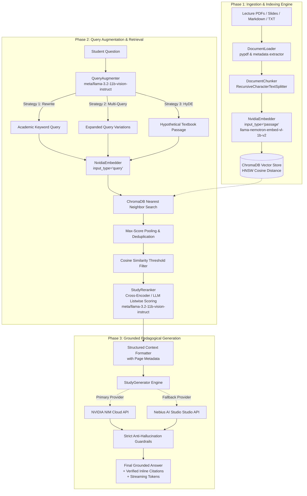
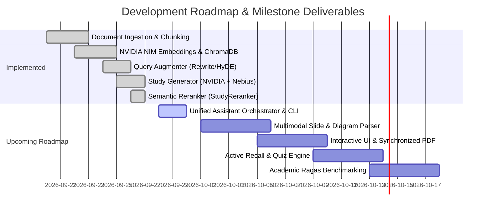

<div align="center">

# 🎓 Study Assistant: Grounded Academic RAG Tutor
### *High-Precision, Zero-Hallucination Academic Question-Answering Powered by NVIDIA NIM & Nebius AI Studio*

[](https://www.python.org/)
[](https://developer.nvidia.com/nim)
[](https://studio.nebius.ai/)
[](https://github.com/Khazar451/study-assistant)
[](https://www.trychroma.com/)
[](https://github.com/Khazar451/study-assistant/actions)
[](https://opensource.org/licenses/MIT)

*Developed for the **Nebius x NVIDIA Global AI Hackathon**.*

---

</div>

## 📌 Table of Contents
- [1. Executive Summary & Problem Statement](#1-executive-summary--problem-statement)
- [2. System Architecture](#2-system-architecture)
- [3. What We Have Built So Far (Current Implementation)](#3-what-we-have-built-so-far-current-implementation)
  - [3.1 Ingestion & Indexing Engine](#31-ingestion--indexing-engine)
  - [3.2 Advanced Retrieval & Query Intelligence](#32-advanced-retrieval--query-intelligence)
  - [3.3 Grounded Generation Engine & Guardrails](#33-grounded-generation-engine--guardrails)
  - [3.4 Automated Testing & CI/CD Pipeline](#34-automated-testing--cicd-pipeline)
- [4. Roadmap & Upcoming Implementations](#4-roadmap--upcoming-implementations)
- [5. Repository Structure](#5-repository-structure)
- [6. Getting Started & Quickstart](#6-getting-started--quickstart)
  - [6.1 Prerequisites & Installation](#61-prerequisites--installation)
  - [6.2 Environment Configuration](#62-environment-configuration)
  - [6.3 Running Ingestion via CLI](#63-running-ingestion-via-cli)
  - [6.4 End-to-End Python Example](#64-end-to-end-python-example)
  - [6.5 Running the Test Suite](#65-running-the-test-suite)
- [7. Questions for Faculty Advisors & Academic Feedback](#7-questions-for-faculty-advisors--academic-feedback)
- [8. Hackathon Evaluation Alignment](#8-hackathon-evaluation-alignment)
- [9. License & Acknowledgments](#9-license--acknowledgments)

---

## 1. Executive Summary & Problem Statement

### The Academic Challenge
Modern university students and researchers are routinely overwhelmed by hundreds of pages of lecture slides, syllabus documents, academic papers, and textbooks across multiple courses. While general-purpose Large Language Models (LLMs) provide rapid answers, they exhibit critical flaws in academic contexts:
1. **Hallucinations & False Assertions:** Generic models invent plausible-sounding equations, theorems, and historical dates.
2. **Lack of Attribution:** Students cannot verify where an explanation originated, making generic AI unsuitable for exam preparation or citation.
3. **Colloquial Query Mismatches:** Students frequently formulate informal, vague study queries that fail to match the formal terminology used in textbooks.

### Our Solution
**Study Assistant** is an end-to-end, grounded **Retrieval-Augmented Generation (RAG)** platform designed specifically for higher education. It transforms dense course documents into an interactive, pedagogical AI tutor that guarantees:
- **Strict Grounding:** Zero outside knowledge assumption; answers are derived exclusively from course materials.
- **Page-Level Source Attribution:** Every claim is paired with inline citations `[Source: <filename>, Page: <page>]`.
- **Hybrid Infrastructure Resilience:** Primary inference powered by **NVIDIA NIM** (high-throughput microservices) with an automated fallback to **Nebius AI Studio Token Factory** (`nvidia/Llama-3.1-Nemotron-70B-Instruct-HF`).
- **Query Intelligence:** Query rewriting, multi-query expansion, and Hypothetical Document Embeddings (HyDE) to bridge student vocabulary with formal academic literature.

---

## 2. System Architecture

The following diagram illustrates the complete dataflow from raw course documents to citation-backed student responses:



---

## 3. What We Have Built So Far (Current Implementation)

The project is structured as a production-grade, modular Python architecture organized under `src/` with complete test coverage in `tests/`.

### 3.1 Ingestion & Indexing Engine (`src/ingestion/`)

The ingestion pipeline handles raw document intake, metadata extraction, semantic segmentation, and idempotent vector persistence:

| Module | Core Class / Function | Technical Responsibility |
| :--- | :--- | :--- |
| [`loader.py`](src/ingestion/loader.py) | `DocumentLoader` | Ingests `.pdf`, `.txt`, and `.md` files. Uses `pypdf` to extract text while tracking **exact 1-indexed page numbers** and uniform file metadata. |
| [`chunker.py`](src/ingestion/chunker.py) | `DocumentChunker`, `chunk_documents` | Employs `RecursiveCharacterTextSplitter` configured for semantic boundary conservation (`\n\n`, `\n`, `. `, ` `). Configurable chunk size (default: 500 chars) and overlap (default: 50 chars) to prevent context fragmentation across formulas. |
| [`embedder.py`](src/ingestion/embedder.py) | `NvidiaEmbedder` | Integrates with **NVIDIA NIM** retrieval models (default: `nvidia/llama-nemotron-embed-vl-1b-v2`). Crucially implements asymmetric embedding: distinguishes between `input_type="passage"` for document chunks and `input_type="query"` for user queries. Supports batched embedding generation. |
| [`indexer.py`](src/ingestion/indexer.py) | `ChromaIndexer` | Wraps ChromaDB with persistent HNSW index using cosine space (`hnsw:space: cosine`). Implements metadata sanitization, deterministic SHA-256 chunk IDs (`_generate_chunk_id`), and **ghost chunk prevention** via `delete_by_path` during re-ingestion. |
| [`pipeline.py`](src/ingestion/pipeline.py) | `IngestionPipeline`, `main()` | Orchestrates the entire ETL workflow with CLI argument parsing (`--file`, `--dir`, `--batch-size`), directory recursion, and isolated exception handling. |

### 3.2 Advanced Retrieval & Query Intelligence (`src/retrieval/`)

Rather than relying on naive single-shot vector lookups, the retrieval layer implements query enhancement algorithms to maximize retrieval recall across academic documents:

| Module | Core Class / Function | Technical Responsibility |
| :--- | :--- | :--- |
| [`query_augmenter.py`](src/retrieval/query_augmenter.py) | `QueryAugmenter` | Implements three prompt-engineered retrieval strategies via NVIDIA NIM LLMs (`meta/llama-3.2-11b-vision-instruct`):<br/>• **Query Rewriting:** Converts informal student queries into technical academic terminology.<br/>• **Multi-Query Expansion:** Generates diverse paraphrases and sub-queries to maximize recall.<br/>• **HyDE (Hypothetical Document Embeddings):** Generates a synthesized textbook passage answering the question, enabling passage-to-passage semantic matching. |
| [`retriever.py`](src/retrieval/retriever.py) | `StudyRetriever` | Computes cosine similarity ($1 - \text{distance}$), enforces configurable minimum score thresholds (`score_threshold`), executes multi-query search with max-score pooling deduplication, and formats context blocks with source and page tags (`format_context`). |
| [`reranker.py`](src/retrieval/reranker.py) | `StudyReranker` | Semantic cross-scoring layer. Evaluates candidate chunks via single-roundtrip LLM listwise scoring (`meta/llama-3.2-11b-vision-instruct`) or dedicated NVIDIA `/v1/ranking` microservices. Features sigmoid logit normalization, monotonic negative-safe imputation ($\min(\text{scores}) - 10^{-4}$), and stable tie-breaking. |

### 3.3 Grounded Generation Engine & Guardrails (`src/generation/`)

The generation layer ensures student answers are pedagogical, structured, and strictly constrained to verified source context:

| Feature | Implementation Details |
| :--- | :--- |
| **Dual Cloud Infrastructure** | Configured with automatic priority: checks `NVIDIA_API_KEY` for NVIDIA NIM endpoints first; if absent, gracefully falls back to `NEBIUS_API_KEY` using Nebius AI Studio's `nvidia/Llama-3.1-Nemotron-70B-Instruct-HF`. |
| **Strict Anti-Hallucination Guardrails** | System prompt instructs the model to rely solely on context excerpts. If context does not contain sufficient facts, the model explicitly outputs: *"Based on the provided study materials, there is not enough information to answer this question."* |
| **Inline Citation Extraction** | Formats answers with `[Source: <filename>, Page: <page>]` markers and validates cited files against the retrieved context using regex parsing. |
| **Streaming Output** | Implements `generate_stream()` returning a token iterator for real-time typewriter animations in frontend interfaces. |

### 3.4 Automated Testing & CI/CD Pipeline (`tests/` & `.github/`)

- **9 Comprehensive Unit Test Suites (73 Tests Passing in ~1.08s):**
  - `tests/test_loader.py`: Validates PDF page extraction, text reading, and unsupported format rejections (5 tests).
  - `tests/test_chunker.py`: Tests boundary preservation, overlap logic, and empty input handling (5 tests).
  - `tests/test_embedder.py`: Validates API payload construction, input typing (`passage` vs `query`), and batching (6 tests).
  - `tests/test_indexer.py`: Tests ChromaDB upsert, query similarity, and path-based deletion (4 tests).
  - `tests/test_pipeline.py`: Tests end-to-end ingestion flow and error isolation (3 tests).
  - `tests/test_query_augmenter.py`: Verifies rewrite, expand, and HyDE prompt executions with mocked LLM clients (11 tests).
  - `tests/test_retriever.py`: Tests similarity scoring, threshold filtering, and multi-query pooling (9 tests).
  - `tests/test_reranker.py`: Validates semantic reranking, sigmoid normalization, monotonic negative imputation, index mapping, and fallback paths (20 tests).
  - `tests/test_generator.py`: Verifies provider switching (NVIDIA vs Nebius), citations, and streaming token yields (10 tests).
- **Continuous Integration (CI):**
  - Configured via `.github/workflows/test.yml` running Pytest automatically on push and pull request against Python 3.11. All 73 tests run green on GitHub Actions without consuming live API credits.

---

## 4. Roadmap & Upcoming Implementations

For the next iteration of the project and hackathon presentation, we are planning and actively architecting the following features:



### 1. Unified Assistant Orchestrator & CLI Interface (`src/assistant.py`)
- **Goal:** Provide a seamless, unified entry point that orchestrates Ingestion, Query Augmentation, ChromaDB Retrieval, Reranking, and Generation into a single API call.
- **Implementation:** Implement `StudyAssistant` with `ask(query, stream=False)` and an interactive command-line interface (`python -m src.assistant --chat`) with real-time typewriter token streaming.

### 2. Multimodal Lecture Slide & Diagram Ingestion
- **Goal:** University lecture slides are heavily visual (e.g., circuit diagrams, biological pathways, chemistry reactions, neural network architectures). Text extraction via PDF parsers loses this visual context.
- **Implementation:** Leverage NVIDIA NIM Vision-Language Models (`meta/llama-3.2-11b-vision-instruct` / `nebius-vision`) to generate rich textual captions and OCR descriptions for images and diagrams during the ingestion phase.

### 3. Interactive Web Application with Synchronized PDF Viewer
- **Goal:** Provide a seamless, split-screen desktop and web UI.
- **Implementation:** FastAPI backend serving Server-Sent Events (SSE) coupled with a modern React/TypeScript frontend. When a student clicks an inline citation `[Source: lecture3.pdf, Page: 14]`, the embedded PDF viewer will jump directly to page 14 and highlight the exact matching excerpt.

### 4. Automated Active Recall Engine (Flashcards & Practice Quizzes)
- **Goal:** Transition from a passive question-answering tool to an active study companion.
- **Implementation:** Implement structured JSON generation prompts that extract key definitions, formulas, and multiple-choice questions grounded in the ingested documents to support Spaced Repetition (Anki exportable format).

### 5. Quantitative Academic Evaluation via Ragas & TruLens
- **Goal:** Rigorously quantify RAG performance to present empirical benchmarks to professors and hackathon judges.
- **Metrics to Evaluate:**
  - **Faithfulness (Groundedness):** Percentage of generated claims supported by retrieved context.
  - **Answer Relevance:** Semantic alignment between student question and answer.
  - **Context Recall & Precision:** Retrieval effectiveness against curated university exam rubrics.

---

## 5. Repository Structure

```
study-assistant/
├── .github/
│   └── workflows/
│       └── test.yml                 # GitHub Actions automated CI testing workflow
├── src/
│   ├── __init__.py
│   ├── ingestion/                   # Document processing, chunking & vectorization
│   │   ├── __init__.py
│   │   ├── chunker.py               # Recursive text chunking with overlap
│   │   ├── embedder.py              # NVIDIA NIM embedding client (asymmetric query/passage)
│   │   ├── indexer.py               # ChromaDB client with HNSW indexing & hash IDs
│   │   ├── loader.py                # Multi-format document loader with page retention
│   │   └── pipeline.py              # End-to-end ingestion pipeline & CLI entrypoint
│   ├── retrieval/                   # Search, query expansion & context synthesis
│   │   ├── __init__.py
│   │   ├── query_augmenter.py       # Query rewriting, multi-query expansion & HyDE
│   │   ├── reranker.py              # Semantic cross-encoder & LLM listwise reranker
│   │   └── retriever.py             # Vector similarity search & context formatting
│   └── generation/                  # Grounded LLM response generation
│       ├── __init__.py
│       └── generator.py             # Dual NVIDIA/Nebius LLM client & citation engine
├── tests/                           # Complete test suite (73 passing tests)
│   ├── conftest.py                  # Pytest fixtures & environment setup
│   ├── test_chunker.py              # Unit tests for text chunking
│   ├── test_embedder.py             # Unit tests for NVIDIA embedding client
│   ├── test_generator.py            # Unit tests for LLM generation & fallback logic
│   ├── test_indexer.py              # Unit tests for ChromaDB storage & queries
│   ├── test_loader.py               # Unit tests for document loading
│   ├── test_pipeline.py             # Integration tests for ingestion pipeline
│   ├── test_query_augmenter.py      # Unit tests for query augmentation strategies
│   ├── test_reranker.py             # Unit tests for semantic reranker (20 tests)
│   └── test_retriever.py            # Unit tests for retrieval & scoring
├── .env.example                     # Sample environment variable configuration
├── .gitignore                       # Ignored files (virtualenvs, cache, db)
├── LICENSE                          # MIT License
├── requirements.txt                 # Pinned dependencies
└── README.md                        # Project documentation & academic report
```

---

## 6. Getting Started & Quickstart

### 6.1 Prerequisites & Installation

- Python 3.10 or 3.11+
- Git

Clone the repository and install dependencies in a virtual environment:

```bash
# Clone the repository
git clone https://github.com/Khazar451/study-assistant.git
cd study-assistant

# Create and activate a virtual environment
python -m venv .venv

# On Linux/macOS:
source .venv/bin/activate
# On Windows (PowerShell):
.venv\Scripts\Activate.ps1

# Install requirements
pip install --upgrade pip
pip install -r requirements.txt
```

### 6.2 Environment Configuration

Create a `.env` file in the project root based on `.env.example`:

```bash
cp .env.example .env
```

Populate your API keys:

```ini
# Primary Provider: NVIDIA NIM
NVIDIA_API_KEY=nvapi-your-key-here
NVIDIA_BASE_URL=https://integrate.api.nvidia.com/v1
EMBEDDING_MODEL=nvidia/llama-nemotron-embed-vl-1b-v2
LLM_MODEL=meta/llama-3.2-11b-vision-instruct

# Fallback Provider: Nebius AI Studio
NEBIUS_API_KEY=your-nebius-key-here
NEBIUS_BASE_URL=https://api.studio.nebius.ai/v1
```

### 6.3 Running Ingestion via CLI

Ingest an individual lecture note file or an entire directory of course materials:

```bash
# Ingest a single PDF file
python -m src.ingestion.pipeline --file "path/to/lecture1.pdf"

# Ingest an entire course folder recursively with custom batch size
python -m src.ingestion.pipeline --dir "path/to/course_materials/" --batch-size 32
```

### 6.4 End-to-End Python Example

Here is how the complete system is instantiated and queried programmatically:

```python
from src.ingestion.indexer import ChromaIndexer
from src.ingestion.embedder import NvidiaEmbedder
from src.retrieval.query_augmenter import QueryAugmenter
from src.retrieval.retriever import StudyRetriever
from src.retrieval.reranker import StudyReranker
from src.generation.generator import StudyGenerator

# 1. Initialize core services
indexer = ChromaIndexer(persist_directory="./chroma_db")
embedder = NvidiaEmbedder()
augmenter = QueryAugmenter()
reranker = StudyReranker(mode="llm_listwise")

# 2. Setup retriever with query augmentation
retriever = StudyRetriever(
    indexer=indexer,
    embedder=embedder,
    augmenter=augmenter,
    top_k=15,
    score_threshold=0.35,
)

# 3. Retrieve candidate chunks using Multi-Query Expansion
query = "What is backpropagation and how does gradient descent update weights?"
candidate_chunks = retriever.retrieve(query, augment=True, augment_mode="expand")

# 4. Rerank candidate chunks with cross-attention relevance scoring
reranked_chunks = reranker.rerank(query=query, chunks=candidate_chunks, top_n=5)

# 5. Generate grounded pedagogical answer
generator = StudyGenerator()
result = generator.generate(query=query, context=reranked_chunks)

print("=== TUTOR RESPONSE ===")
print(result["answer"])
print("\n=== CITED SOURCES ===")
print(result["sources"])
```

### 6.5 Running the Test Suite

Execute the full suite of unit and integration tests:

```bash
pytest tests/ -v
```

---

## 7. Questions for Faculty Advisors & Academic Feedback

We are actively seeking feedback from professors and academic mentors on the following core design considerations:

1. **Chunking Strategies for Mathematical & Technical Literature:**
   - *Question:* In mathematical proofs or engineering derivations, standard recursive character chunking can split an equation across boundaries. What boundary markers or semantic chunking strategies (e.g., AST-based or LaTeX-aware chunking) would you recommend for technical textbooks?
2. **Pedagogical Persona & Scaffolding:**
   - *Question:* Should an academic study assistant directly provide the full answer with citations, or would an adjustable **Socratic scaffolding mode** (prompting the student with hints and guiding questions based on the lecture slides) be more beneficial for genuine learning outcomes?
3. **Evaluation Metrics for Course Mastery:**
   - *Question:* When measuring the efficacy of the assistant against real students, which evaluation dimensions would best measure educational impact (e.g., time-to-mastery, reduction in misconception rate, or score improvement on standardized exams)?

---

## 8. Hackathon Evaluation Alignment

This project is built to satisfy the core evaluation criteria of the **Nebius x NVIDIA Hackathon**:

| Hackathon Criterion | Project Implementation & Proof Points |
| :--- | :--- |
| **NVIDIA Technology Utilization** | • NVIDIA NIM `nvidia/llama-nemotron-embed-vl-1b-v2` for state-of-the-art embedding retrieval.<br/>• NVIDIA NIM `meta/llama-3.2-11b-vision-instruct` for query enhancement and grounded reasoning.<br/>• Prepared integration for NVIDIA NeMo Reranker (`nvidia/reranking-nemotron-4b`). |
| **Nebius AI Studio Integration** | • Seamless resilient dual-provider fallback architecture leveraging Nebius Token Factory.<br/>• High-throughput inference for large-scale document synthesis (`nvidia/Llama-3.1-Nemotron-70B-Instruct-HF`). |
| **Technical Depth & Engineering Rigor** | • Complete separation of concerns (ETL, Vector Indexing, Query Augmentation, Generation).<br/>• Idempotent chunking with SHA-256 deterministic IDs, eliminating ghost chunks.<br/>• 8 automated test suites with GitHub Actions CI pipeline. |
| **Real-World Impact & Feasibility** | • Solves a tangible, daily problem for thousands of university students and faculty.<br/>• Strict zero-hallucination guardrails and auditable page-level citations. |

---

## 9. License & Acknowledgments

- **License:** Distributed under the [MIT License](LICENSE).
- **Special Thanks:**
  - **Nebius AI Studio** for cloud GPU compute and OpenAI-compatible inference APIs.
  - **NVIDIA** for high-efficiency NIM microservices and cutting-edge retrieval models.
  - Course instructors and faculty advisors for pedagogical guidance and course data testing.
